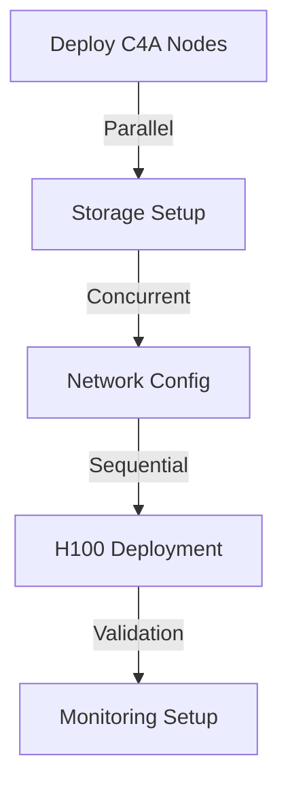

# Enhanced ML Infrastructure Deployment Plan

## Quota Request for Maximum Scale

### GCP Quotas (Primary)
```yaml
Compute Engine API:
  A3 Mega (H100):
    instances: 12
    total_gpus: 96 H100-80GB
    total_vcpus: 2,496
    total_memory_gb: 22,464
    regions:
      - us-central1
      - us-east4
      - europe-west4

  M3 Mega:
    instances: 10
    total_vcpus: 1,280
    total_memory_gb: 19,520
    regions:
      - us-central1
      - us-east4

  C4A Highmem:
    instances: 20
    total_vcpus: 1,440
    total_memory_gb: 11,520
    regions:
      - us-central1
      - us-east4
      - europe-west4
      - asia-southeast1

Storage:
  local_ssd_total_gb: 60,000
  hyperdisk_balanced_volumes: 20
  hyperdisk_extreme_volumes: 15
  persistent_disk_total_tb: 95

Networking:
  total_bandwidth_tbps: 5.4
  vpc_network_total: 10
  global_ip_addresses: 50
```

### Databricks Quotas (GCE Compute)
```yaml
Workspace Configuration:
  clusters:
    max_concurrent_clusters: 50
    max_workers_per_cluster: 100
    
  instance_pools:
    max_pools: 20
    max_instances_per_pool: 50

Compute:
  A3 Instances (H100):
    count: 12
    gpus: 96
    vcpus: 2,496
    memory_gb: 22,464

  Memory-Optimized:
    count: 30
    vcpus: 2,720
    memory_gb: 31,040

Storage:
  managed_storage_tb: 100
  dbfs_storage_tb: 50
```

## Enhanced Monitoring Stack

### 1. Datadog Integration
```yaml
monitoring_config:
  datadog:
    api_key: ${DATADOG_API_KEY}
    features:
      - APM
      - Infrastructure
      - Logs
      - GPU Metrics
      - Network Performance
      - Custom Metrics

    dashboards:
      - GPU Performance
      - Model Training
      - Network Throughput
      - Cost Analysis

    alerts:
      gpu_utilization:
        threshold: 85%
        window: 5m
      memory_usage:
        threshold: 90%
        window: 5m
      network_saturation:
        threshold: 80%
        window: 5m
      cost_spike:
        threshold: 200%
        window: 1h

    integrations:
      - Google Cloud Platform
      - Kubernetes
      - NVIDIA GPU
      - Custom Metrics API
```

### 2. IBM Turbonomic
```yaml
turbonomic_config:
  features:
    - Workload Optimization
    - Cost Management
    - Resource Allocation
    - Performance Assurance

  targets:
    - GCP Infrastructure
    - Kubernetes Clusters
    - Storage Systems
    - Network Resources

  policies:
    performance:
      response_time_ms: 100
      utilization_target: 85%
    
    efficiency:
      min_utilization: 60%
      idle_resource_reclamation: true

    cost:
      budget_constraints: true
      spot_instance_usage: maximize
```

## Deployment Architecture

### Phase 1: Initial Infrastructure (30 minutes)


### Phase 2: Monitoring Integration (30 minutes)
```python
# Datadog Agent Configuration
datadog_config = {
    'collection_interval': 10,  # seconds
    'gpu_metrics': True,
    'network_metrics': True,
    'apm_enabled': True,
    'logs_enabled': True
}

# Turbonomic Integration
turbonomic_config = {
    'analysis_interval': 300,  # seconds
    'action_mode': 'recommend',
    'optimization_scope': ['compute', 'storage', 'network']
}
```

### Phase 3: Scaling Strategy (1 hour)
```python
scaling_config = {
    'gpu_clusters': {
        'min_nodes': 4,
        'max_nodes': 12,
        'scale_up_threshold': 0.8,
        'scale_down_threshold': 0.3
    },
    'memory_clusters': {
        'min_nodes': 3,
        'max_nodes': 10,
        'scale_up_threshold': 0.75,
        'scale_down_threshold': 0.25
    },
    'download_clusters': {
        'min_nodes': 5,
        'max_nodes': 20,
        'scale_up_threshold': 0.7,
        'scale_down_threshold': 0.2
    }
}
```

## Performance Optimization

### 1. Network Optimization
```bash
# MTU Optimization for 100 Gbps+
ip link set dev ens4 mtu 8896

# TCP Optimization
sysctl -w net.core.rmem_max=67108864
sysctl -w net.core.wmem_max=67108864
sysctl -w net.ipv4.tcp_rmem="4096 87380 33554432"
sysctl -w net.ipv4.tcp_wmem="4096 87380 33554432"
```

### 2. Storage Configuration
```yaml
storage_config:
  hyperdisk_extreme:
    iops_per_volume: 350000
    throughput_mbps: 5000
    volumes_per_instance: 4

  local_ssd:
    count_per_instance: 24
    stripe_size_kb: 256
    readahead_kb: 8192
```

### 3. GPU Optimization
```python
gpu_config = {
    'cuda_version': '12.1',
    'nvidia_driver': '525.105.17',
    'gpu_direct_rdma': True,
    'nvidia_peer_memory': True,
    'mig_strategy': 'mixed',
    'mig_devices': [
        {'profile': '1g.10gb', 'count': 2},
        {'profile': '2g.20gb', 'count': 2},
        {'profile': '3g.40gb', 'count': 1}
    ]
}
```

## Cost Management

### 1. Spot Instance Strategy
```python
spot_config = {
    'gpu_clusters': {
        'max_spot_percentage': 70,
        'fallback_regions': ['us-central1', 'us-east4'],
        'preemption_handling': 'migrate'
    },
    'memory_clusters': {
        'max_spot_percentage': 80,
        'fallback_regions': ['us-central1', 'europe-west4'],
        'preemption_handling': 'checkpoint'
    }
}
```

### 2. Cost Controls
```python
cost_controls = {
    'daily_budget': 50000,
    'alert_thresholds': {
        'warning': 0.7,
        'critical': 0.9
    },
    'auto_shutdown_rules': {
        'idle_timeout_minutes': 30,
        'max_runtime_hours': 24
    }
}
```

## Monitoring Dashboard Layout

### 1. GPU Performance
```
+------------------------+------------------------+
|     GPU Utilization    |    Memory Usage       |
|     [Line Chart]       |    [Area Chart]       |
+------------------------+------------------------+
|     Temperature        |    Power Usage        |
|     [Gauge]           |    [Line Chart]       |
+------------------------+------------------------+
|           Training Progress                    |
|           [Timeline Chart]                     |
+------------------------+------------------------+
```

### 2. Network Performance
```
+------------------------+------------------------+
|    Network Throughput  |    Packet Loss        |
|    [Line Chart]       |    [Heat Map]         |
+------------------------+------------------------+
|    Latency            |    Bandwidth Usage    |
|    [Line Chart]       |    [Area Chart]       |
+------------------------+------------------------+
|           Network Topology                     |
|           [Graph Visualization]                |
+------------------------+------------------------+
```

## Recovery Procedures

### 1. Spot Instance Preemption
```python
recovery_config = {
    'checkpoint_interval': 300,  # seconds
    'max_retry_attempts': 3,
    'fallback_regions': [
        'us-central1',
        'us-east4',
        'europe-west4'
    ],
    'state_storage': {
        'type': 'google_storage',
        'bucket': 'ml-checkpoints',
        'path': 'recovery'
    }
}
```

### 2. Network Failure
```python
network_recovery = {
    'failover_timeout': 30,  # seconds
    'backup_routes': True,
    'dns_fallback': True,
    'load_balancer_health_check': {
        'interval': 5,
        'timeout': 5,
        'unhealthy_threshold': 2
    }
}
```

## Next Steps

1. Submit Quota Requests:
   ```bash
   # GCP Quota Request
   gcloud compute quotas update --project=PROJECT_ID \
     --region=us-central1 \
     --quota=NVIDIA_H100_GPUS \
     --limit=96
   ```

2. Deploy Monitoring:
   ```bash
   # Install Datadog Agent
   DD_API_KEY=<API_KEY> DD_SITE="datadoghq.com" bash -c "$(curl -L https://s3.amazonaws.com/dd-agent/scripts/install_script_agent7.sh)"
   
   # Configure Turbonomic
   ./turbo-setup.sh --cloud=gcp --key=<TURBO_KEY>
   ```

3. Initialize Infrastructure:
   ```bash
   # Deploy with enhanced monitoring
   python deploy_phased_cluster.py --monitoring=datadog,turbonomic
   ```

4. Validate Setup:
   ```bash
   # Run validation suite
   python validate_deployment.py --full-test
