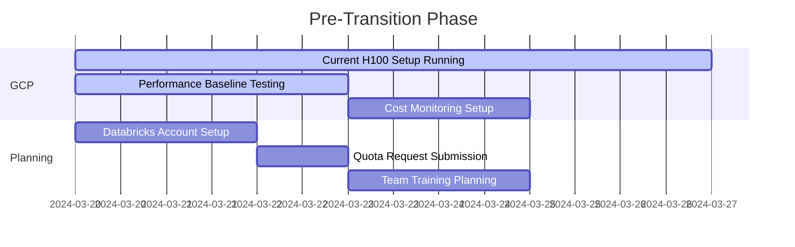
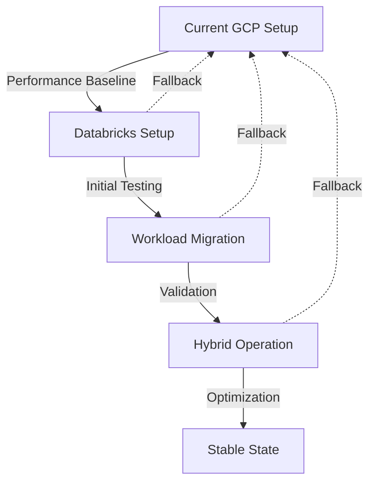

# GCP to Databricks Transition Timeline

## Phase 0: Pre-Transition (Current Week)


## Phase 1: Initial Databricks Setup (Week 1)

### Day 1-2: Environment Setup
- [ ] Workspace Configuration
  ```python
  # Databricks workspace setup
  workspace_config = {
      'cluster_mode': 'High Concurrency',
      'runtime': 'ML Runtime 14.3',
      'node_type': 'Standard_A100_v5',
      'min_workers': 2,
      'max_workers': 8
  }
  ```

### Day 3-5: Parallel Infrastructure
```
Current GCP          Databricks
+----------+        +----------+
|  H100s   |  ←→    |  A100s   |
+----------+        +----------+
     ↓                   ↓
+----------+        +----------+
|  C4As    |  ←→    | Delta    |
+----------+        | Lake     |
                   +----------+
```

### Day 6-7: Initial Testing
- [ ] Performance Benchmarks
  ```python
  # Benchmark suite
  benchmarks = {
      'training_throughput': [
          'small_batch',
          'large_batch',
          'distributed'
      ],
      'inference_latency': [
          'single_request',
          'batch_request',
          'streaming'
      ]
  }
  ```

## Phase 2: Workload Migration (Week 2)

### Day 8-10: Data Migration
```sql
-- Delta Lake table creation
CREATE TABLE models
USING DELTA
LOCATION '/mnt/models'
TBLPROPERTIES (
  'delta.autoOptimize.optimizeWrite' = 'true',
  'delta.autoOptimize.autoCompact' = 'true'
)
```

### Day 11-12: Pipeline Migration
```yaml
# Databricks workflow
workflow:
  name: model_training
  schedule:
    quartz_cron_expression: "0 0 * * * ?"
    timezone_id: UTC
  tasks:
    - task_key: data_prep
      notebook_task:
        notebook_path: /Shared/data_prep
    - task_key: training
      notebook_task:
        notebook_path: /Shared/training
      depends_on:
        - task_key: data_prep
```

### Day 13-14: Performance Tuning
```python
# Performance optimization
optimization_targets = {
    'compute': {
        'photon_enabled': True,
        'adaptive_scaling': True,
        'gpu_memory_utilization': 0.85
    },
    'storage': {
        'z_ordering_columns': ['model_id', 'version'],
        'vacuum_retention_hours': 168
    }
}
```

## Phase 3: Hybrid Operation (Week 3-4)

### Week 3: Load Distribution
```
Workload Distribution:
+------------------------+
| Databricks (60%)       |
|  - Standard Training   |
|  - Batch Inference    |
|  - Data Processing    |
+------------------------+
| GCP H100s (40%)       |
|  - Large Models       |
|  - Real-time Inference|
|  - Custom Training    |
+------------------------+
```

### Week 4: Optimization
```python
# Cost optimization rules
cost_rules = {
    'databricks': {
        'min_dbu_utilization': 0.8,
        'spot_instance_target': 0.7,
        'cluster_idle_timeout': 30
    },
    'gcp': {
        'spot_instance_target': 0.6,
        'min_gpu_utilization': 0.85,
        'max_idle_time': 15
    }
}
```

## Critical Path Dependencies



## Rollback Points

### Immediate Rollback
```bash
# Quick return to GCP
./deploy_phased_cluster.py --mode=recovery
```

### Gradual Rollback
```python
# Controlled workload return
rollback_plan = {
    'stage1': {
        'duration': '1 day',
        'workload_shift': 0.25
    },
    'stage2': {
        'duration': '2 days',
        'workload_shift': 0.50
    },
    'stage3': {
        'duration': '1 day',
        'workload_shift': 0.25
    }
}
```

## Success Metrics

### Performance Metrics
```python
metrics = {
    'training': {
        'throughput': '>= 95% of GCP',
        'convergence': '<= 105% of GCP time'
    },
    'inference': {
        'latency': '<= 110% of GCP',
        'throughput': '>= 90% of GCP'
    },
    'cost': {
        'total': '<= 70% of GCP',
        'per_training': '<= 75% of GCP'
    }
}
```

### Operational Metrics
```yaml
operational_kpis:
  uptime: ">=99.9%"
  deployment_time: "<=10 minutes"
  recovery_time: "<=15 minutes"
  resource_utilization: ">=85%"
```

## Monitoring Setup

### Real-time Monitoring
```python
# Unified monitoring
monitoring_config = {
    'metrics': [
        'gpu_utilization',
        'training_throughput',
        'inference_latency',
        'cost_per_training_hour'
    ],
    'alerts': {
        'cost_threshold': 1000,  # Alert at $1K/day
        'performance_degradation': 0.15  # Alert at 15% drop
    }
}
```

### Cost Tracking
```sql
-- Daily cost analysis
SELECT 
    date,
    SUM(compute_cost) as compute_cost,
    SUM(storage_cost) as storage_cost,
    SUM(network_cost) as network_cost
FROM cost_metrics
GROUP BY date
ORDER BY date DESC
```

## Team Training Plan

### Week 1: Basics
- Databricks workspace
- Delta Lake concepts
- MLflow integration

### Week 2: Advanced
- Distributed training
- Pipeline optimization
- Cost management

### Week 3: Expert
- Custom optimizations
- Advanced monitoring
- Troubleshooting

## Documentation Requirements

### Technical Documentation
- Architecture diagrams
- Configuration guides
- Optimization rules

### Operational Documentation
- Runbooks
- Troubleshooting guides
- Best practices

### Training Documentation
- Setup guides
- Example notebooks
- Common pitfalls
